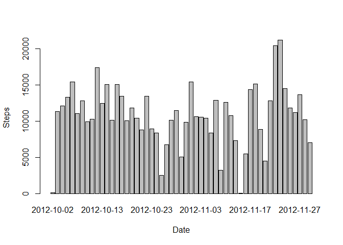
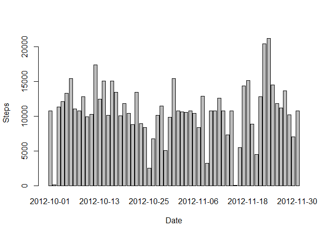
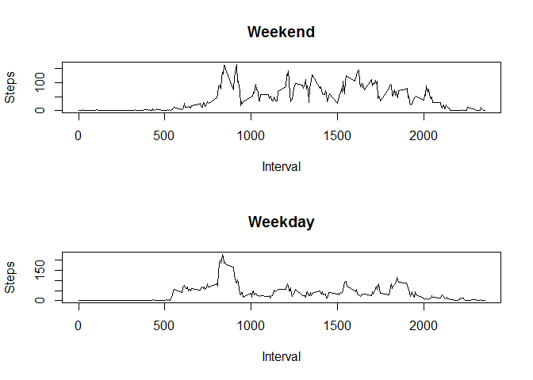

# Reproducible Research: Peer Assessment 1


## Loading and preprocessing the data

```r
setwd("~/IDA/RepDataPA1")
ActData <- read.csv("activity.csv")
names(ActData)[1]<-"Steps"
names(ActData)[2]<-"Date"
names(ActData)[3]<-"Interval"
```


## What is mean total number of steps taken per day?

### Histogram of the total number of steps taken each day

```r
DailySteps <- aggregate(Steps ~ Date, data = ActData, FUN = sum)
barplot(DailySteps$Steps, names.arg = DailySteps$Date, xlab = "Date", ylab = "Steps")
```

 

### Mean total number of steps taken per day

```r
mean(DailySteps$Steps)
```

```
## [1] 10766.19
```

### Median total number of steps taken per day

```r
median(DailySteps$Steps)
```

```
## [1] 10765
```


## What is the average daily activity pattern?

### Time series plot (i.e. type = "l") of the 5-minute interval (x-axis) and
### the average number of steps taken, averaged across all days (y-axis)

```r
AvgStepsInt<- aggregate(Steps ~ Interval, data = ActData, FUN = mean)
plot(AvgStepsInt, type = "l")
```

 
### Average across all the days in the dataset, contains the maximum number of steps in 5-minute interval

```r
AvgStepsInt$Interval[which.max(AvgStepsInt$steps)]
```

```
## integer(0)
```


## Imputing missing values

### Total number of missing values in the dataset

```r
sum(is.na(ActData))
```

```
## [1] 2304
```
### Devise a  simple strategy for filling in all of the missing values in the dataset
### using mean for that 5-minute interval

### A new dataset that is equal to the original dataset but with the missing data filled in.

```r
MActData <- merge(ActData, AvgStepsInt, by = "Interval", suffixes = c("", ".y"))
NASteps <- is.na(MActData$Steps)
MActData$Steps[NASteps] <- MActData$Steps.y[NASteps]
MActData <- MActData[, c(1:3)]
```
### Histogram of the total number of steps taken each day

```r
DailySteps2 <- aggregate(Steps ~ Date, data = MActData, FUN = sum)
barplot(DailySteps2$Steps, names.arg = DailySteps2$Date, xlab = "Date", ylab = "Steps")
```

 
### Mean total number of steps taken per day

```r
mean(DailySteps2$Steps)
```

```
## [1] 10766.19
```
### Median total number of steps taken per day

```r
median(DailySteps2$Steps)
```

```
## [1] 10766.19
```


## Are there differences in activity patterns between weekdays and weekends?

### A new factor variable in the dataset with two levels - "weekday" and "weekend"
### indicating whether a given date is a weekday or weekend day.

```r
DayType <- function(Date) {
  if (weekdays(as.Date(Date)) %in% c("Saturday", "Sunday")) {
    "Weekend"
  } else {
    "Weekday"
  }
}
MActData$DayType <- as.factor(sapply(MActData$Date, DayType))
```

### A panel plot containing a time series plot (i.e. type = "l") of the 5-minute interval (x-axis)
### and the average number of steps taken, averaged across all weekday days or weekend days (y-axis)

```r
par(mfrow = c(2, 1))
for (type in c("Weekend", "Weekday")) {
  StepsType <- aggregate(Steps ~ Interval, data = MActData, subset = MActData$DayType == type, FUN = mean)
  plot(StepsType, type = "l", main = type)
}
```

 
